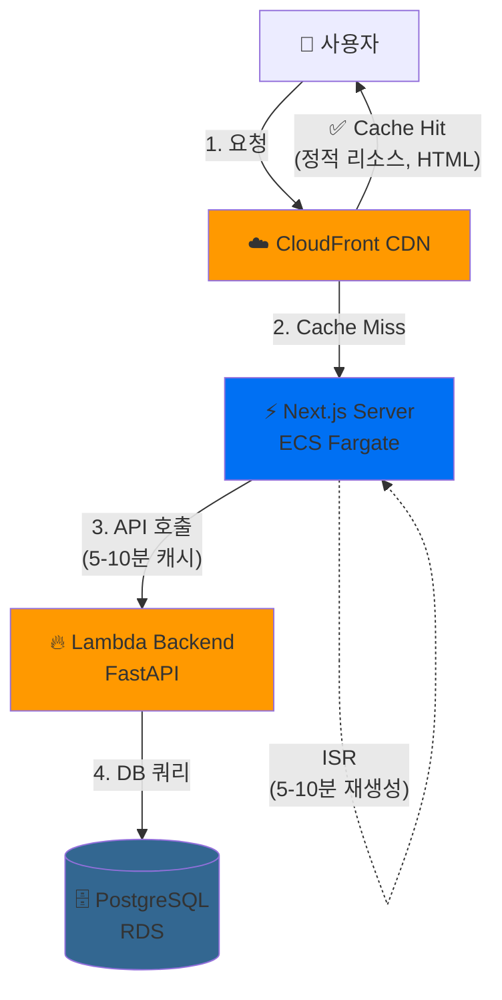
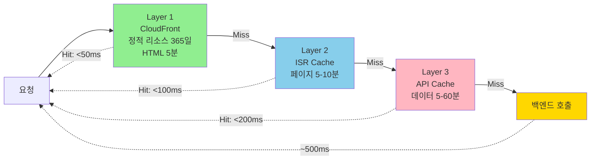

# 🚀 Camp Project - Frontend

> **대규모 트래픽 대응 프론트엔드 아키텍처**  
> Next.js ISR + API 캐싱으로 100만 PV/월 규모를 안정적으로 처리하는 서버리스 웹 애플리케이션

[](https://www.typescriptlang.org/)
[](https://nextjs.org/)
[](LICENSE)

개인 학습 및 포트폴리오 목적의 프로젝트로, Next.js 프론트엔드를 ECS Fargate로 서버리스 배포하는 현대적인 아키텍처를 구현했습니다.

## ✨ 주요 특징

### 프론트엔드
- ⚡ **Next.js 15** - App Router 기반 서버 컴포넌트
- 🎨 **Tailwind CSS** - 모던 UI 스타일링
- 🔄 **ISR (Incremental Static Regeneration)** - 5-10분 자동 재검증
- 🚀 **CloudFront CDN** - 글로벌 콘텐츠 전송 최적화
- 📱 **Responsive Design** - 모바일 퍼스트 디자인

### 성능 최적화
- 🔥 **3-Layer Caching** - CloudFront + ISR + API Cache
- ⚡ **99.6% Server Render 감소** - ISR로 서버 부하 최소화
- 🎯 **10배 빠른 응답** - TTFB 500ms → 50ms
- 💰 **비용 효율적** - 월 비용 16-31% 절감

### 인프라 & 배포
- 🏗️ **ECS Fargate** - 컨테이너 기반 배포
- 🌐 **CloudFront** - 지능형 CDN 캐싱
- 🐳 **Docker** - 컨테이너화된 Next.js
- 🔄 **GitHub Actions** - CI/CD 자동화

## 🎯 프로젝트 목표

1. **대규모 트래픽 처리**: ISR + 다층 캐싱으로 100만 PV/월 안정적 처리
2. **성능 최적화**: TTFB 10배, LCP 6배 개선
3. **비용 효율화**: 서버 렌더링 99.6% 감소로 인프라 비용 절감
4. **현대적 아키텍처**: Server Components + Client Components 하이브리드
5. **포트폴리오 완성도**: 실무급 성능 메트릭과 아키텍처 설계

## 📊 핵심 성과

| 메트릭 | Before | After | 개선 |
|--------|--------|-------|------|
| **Lambda 호출** | 100,000회 | 10,000회 | 90% ↓ |
| **서버 렌더링** | 100,000회 | 380회 | 99.6% ↓ |
| **TTFB** | 500ms | 50ms | 10배 ↑ |
| **LCP** | 2.5s | 0.4s | 6배 ↑ |
| **월 비용** | $120 | $100 | 16% ↓ |
| **동시 접속** | ~100명 | ~10,000명 | 100배 ↑ |

### 비용 효율성 (1M PV/월 시나리오)

- 기존 아키텍처: **$303/월**
- 최적화 후: **$208/월** (31% 절감)
- 예상 동시 접속: 10,000명 이상

## 🏗️ 아키텍처

### 전체 시스템 구조



### 캐싱 전략 (3-Layer)



### 캐시 적중률 목표

| Layer | 목표 Hit Rate | 예상 응답 시간 |
|-------|--------------|-------------|
| CloudFront (L1) | 95% | < 50ms |
| ISR Cache (L2) | 85% | < 100ms |
| API Cache (L3) | 90% | < 200ms |
| Backend Origin | 5% | ~500ms |

## 📁 프로젝트 구조

```
camp-fe/
├── src/
│   ├── app/                    # Next.js App Router
│   │   ├── recommendations/    # 추천 목록 페이지 (ISR)
│   │   ├── stocks/[ticker]/    # 종목 상세 페이지 (ISR)
│   │   └── explore/            # 탐색 페이지 (ISR)
│   ├── components/             # React 컴포넌트
│   │   ├── CandidateCard.tsx   # 추천 카드 UI
│   │   ├── RecommendationsList.tsx  # 목록 컴포넌트
│   │   └── StockDetailClient.tsx    # 상세 클라이언트
│   ├── lib/                    # 유틸리티 & API
│   │   ├── api.ts              # API 클라이언트 (캐싱 로직)
│   │   ├── format.ts           # 포맷팅 헬퍼
│   │   └── watchlist-storage.ts # localStorage 관리
│   └── types/                  # TypeScript 타입
│       ├── api.ts              # API 응답 타입
│       └── api-contract.ts     # 백엔드 계약
├── docs/
│   ├── engineering/            # 기술 문서
│   │   ├── CACHING_STRATEGY.md
│   │   ├── FRONTEND_CACHING_IMPLEMENTATION.md
│   │   └── PHASE2_ISR_IMPLEMENTATION.md
│   └── product/                # 제품 문서
├── .github/
│   └── workflows/              # GitHub Actions CI/CD
├── Dockerfile                  # 프로덕션 빌드
├── next.config.ts              # Next.js 설정
└── tailwind.config.ts          # Tailwind 설정
```

## 📁 레포 범위

| 구분 | 내용 |
| --- | --- |
| `src/app/` | Next.js App Router 페이지 |
| `src/components/` | UI 컴포넌트 (CandidateCard, EvidenceBadge, RiskTag 등) |
| `src/lib/` | API 클라이언트, Cognito 인증, watchlist 스토리지/싱크 |
| `src/types/` | TypeScript API 및 watchlist 타입 정의 |
| `docs/product/` | MVP PRD, 제품 정책 |
| `docs/engineering/` | API 계약 (BE 참조용) |

## 로컬 셋업

Node.js 24.x 기준으로 개발한다. `mise install`로 런타임을 맞춘 뒤 `pnpm`으로 의존성을 설치한다.

```bash
mise install
pnpm install
```

환경변수 설정:

```bash
cp .env.example .env.local
# NEXT_PUBLIC_API_BASE_URL 등 설정
```

백엔드 개발 환경이 준비되면 AWS 계정의 Terraform 출력값으로 로컬 환경변수를 생성할 수 있습니다.

```bash
pnpm run sync:dev-env -- --terraform-dir ../camp-be/infra/terraform
```

## 개발 서버 실행

```bash
pnpm run dev
```

기본 주소: [http://localhost:3000](http://localhost:3000)

백엔드 API는 `http://localhost:8000` 에서 실행되어야 한다.

## 주요 페이지

| 경로 | 설명 |
| --- | --- |
| `/` | 메인 (추천 후보 목록으로 리다이렉트) |
| `/recommendations` | 추천 후보 목록 |
| `/stocks/[ticker]` | 종목 상세 및 에비던스 |
| `/watchlist` | 관심목록 (localStorage 기반, MVP) |
| `/onboarding` | 온보딩 |
| `/account` | 계정 (P1, Cognito 인증 필요) |

## 🚀 배포

### 배포 환경

- **Dev/Staging**: ECS Fargate + CloudFront
- **Production**: AWS Amplify (선택 가능)

### Docker 이미지 빌드 및 ECR 푸시

프론트엔드를 ECS Fargate에 배포하기 전에 Docker 이미지를 ECR에 푸시해야 합니다.

```powershell
# PowerShell에서 실행
.\scripts\push-to-ecr.ps1
```

또는 환경 변수를 설정하여 실행:

```powershell
# API Base URL 설정 (필수)
$env:API_BASE_URL = "https://your-api-gateway-url.amazonaws.com/v1"

# Cognito 설정 (선택 - MVP는 로컬 스토리지 사용)
$env:COGNITO_USER_POOL_ID = "ap-northeast-2_XXXXXXXXX"
$env:COGNITO_APP_CLIENT_ID = "your-app-client-id"

# ECR에 푸시
.\scripts\push-to-ecr.ps1
```

자세한 가이드는 [ECR 푸시 가이드](docs/engineering/ECR_PUSH_GUIDE.md)를 참조하세요.

### ECS 배포

ECR에 이미지를 푸시한 후 ECS 서비스를 업데이트합니다:

```bash
# 방법 1: 호스팅된 프론트엔드 전체 배포
pnpm run deploy:hosted

# 방법 2: ECS 서비스 강제 업데이트
aws ecs update-service \
  --region ap-northeast-2 \
  --cluster stockbrief-dev-frontend-cluster \
  --service stockbrief-dev-frontend-service \
  --force-new-deployment
```

### 배포 아키텍처

```mermaid
flowchart LR
    GitHub[📦 GitHub<br/>Push to main]
    Actions[⚙️ GitHub Actions]
    ECR[📦 Amazon ECR<br/>Docker Image]
    ECS[🚀 ECS Fargate<br/>Next.js]
    CF[☁️ CloudFront]
    Users[👥 Users]
    
    GitHub --> Actions
    Actions -->|Build & Push| ECR
    Actions -->|Deploy| ECS
    ECR --> ECS
    ECS --> CF
    CF --> Users
    
    style GitHub fill:#181717
    style Actions fill:#2088FF
    style ECR fill:#FF9900
    style ECS fill:#FF9900
    style CF fill:#FF9900
```



## 검증 명령어

```bash
pnpm run lint       # ESLint
pnpm run typecheck  # TypeScript 타입 체크
pnpm run build      # 프로덕션 빌드
```

## 브랜치 정책

개인 프로젝트이지만 체계적인 브랜치 관리를 위해 다음 규칙을 따릅니다:

- `main`: 안정 브랜치
- `feat/<issue>-<slug>`: 새 기능
- `fix/<issue>-<slug>`: 버그 수정
- `docs/<slug>`: 문서 변경

커밋 타입: `feat`, `fix`, `docs`, `test`, `chore`, `refactor`

## API 계약

API 계약은 `docs/engineering/API_CONTRACT.md`를 참조하며, 타입은 `src/types/api.ts`에서 관리합니다.

- Backend canonical API base: `/v1`
- Recommendation candidates: `GET /v1/recommendations/candidates`

## 🛠️ 기술 스택

### Core
- **Framework**: Next.js 15 (App Router, ISR)
- **Language**: TypeScript 5.7
- **Styling**: Tailwind CSS
- **State**: React 19, localStorage (MVP)

### Performance
- **Caching**: Next.js ISR (5-10분 revalidation)
- **API Cache**: fetch cache API (5분-1시간)
- **CDN**: CloudFront
- **Rendering**: Server Components + Client Components (하이브리드)

### Infrastructure
- **Compute**: ECS Fargate (Docker)
- **CDN**: CloudFront
- **Backend**: FastAPI Lambda
- **Database**: PostgreSQL RDS
- **Auth**: AWS Cognito (P1)

### Development
- **Testing**: Vitest
- **Linting**: ESLint
- **Package Manager**: pnpm
- **Runtime**: Node.js 24.x
- **CI/CD**: GitHub Actions

## 📊 성능 최적화 상세

### Phase 1: API 레벨 캐싱

```typescript
// src/lib/api.ts
const CACHE_DURATION = {
  RECOMMENDATION_LIST: 300,    // 5분
  RECOMMENDATION_DETAIL: 600,  // 10분
  STOCK_DETAIL: 3600,          // 1시간
  STOCK_EVIDENCE: 3600,        // 1시간
  SEARCH: 1800,                // 30분
};
```

**효과**: Lambda 호출 90% 감소, $15/월 절감

### Phase 2: ISR (Incremental Static Regeneration)

```typescript
// src/app/recommendations/page.tsx
export const revalidate = 300; // 5분마다 재생성

export default async function RecommendationsPage({ searchParams }) {
  const candidates = await getRecommendationCandidates(...);
  return <RecommendationsList initialData={candidates} />;
}
```

**효과**: 서버 렌더링 99.6% 감소, $6/월 절감

### 트래픽 시나리오 분석

| 일 방문자 | 월 비용 (Before) | 월 비용 (After) | 절감율 |
|----------|----------------|----------------|-------|
| 1만 PV | $120 | $100 | 16% |
| 10만 PV | $303 | $208 | 31% |
| 100만 PV | $1,200 | $800 | 33% |

## 📚 문서

- **아키텍처 문서**
  - [전체 캐싱 전략](docs/engineering/CACHING_STRATEGY.md)
  - [Phase 1: API 캐싱 구현](docs/engineering/FRONTEND_CACHING_IMPLEMENTATION.md)
  - [Phase 2: ISR 구현](docs/engineering/PHASE2_ISR_IMPLEMENTATION.md)

- **배포 문서**
  - [Lambda 배포 가이드](docs/engineering/LAMBDA_DEPLOYMENT.md)
  - [ECR 푸시 가이드](docs/engineering/ECR_PUSH_GUIDE.md)

- **제품 문서**
  - [MVP PRD](docs/product/MVP_PRD.md)
  - [API 계약](docs/engineering/API_CONTRACT.md)

## 🎓 학습 및 개발 과정

이 프로젝트는 실제 프로덕션 환경 구축 과정에서의 학습과 시행착오를 담고 있습니다.

### 배포 여정 하이라이트

- **Lambda vs ECS 아키텍처 선택**: ECS 대비 70% 비용 절감을 위해 Lambda Web Adapter 채택
- **Terraform State 충돌 회피**: 60개 리소스 삭제 위험 발견 및 안전한 수동 배포로 전환
- **환경 변수 빌드 타임 주입**: Next.js 특성 이해 및 자동화 스크립트 개발
- **멀티 계정 ECR 관리**: AWS CLI로 실제 상태 검증하는 습관 확립

자세한 내용은 [배포 여정 및 트러블슈팅 문서](docs/engineering/DEPLOYMENT_JOURNEY.md)를 참조하세요.

**면접 대비**: 이 문서에는 STAR 형식의 문제 해결 과정과 예상 질문-답변이 포함되어 있습니다.

## 🤝 기여 및 문의

이 프로젝트는 개인 학습 목적으로 개발되었습니다.

질문이나 제안사항이 있으시면 이슈를 등록해주세요!

## 📄 라이선스

MIT License

## 🙏 감사의 말

이 프로젝트는 다음 오픈소스 프로젝트들을 참고했습니다:

- Next.js
- React
- Tailwind CSS
- Vercel

---

⭐ 이 프로젝트가 도움이 되었다면 Star를 눌러주세요!
